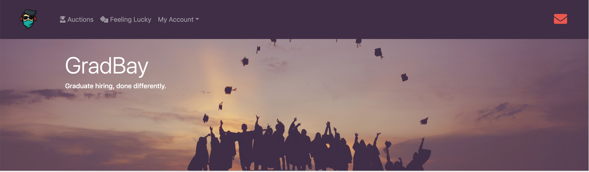
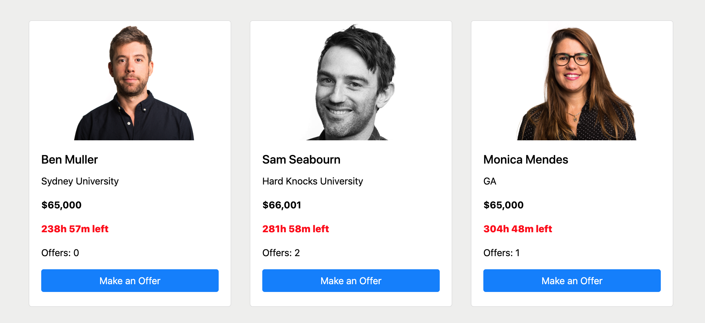
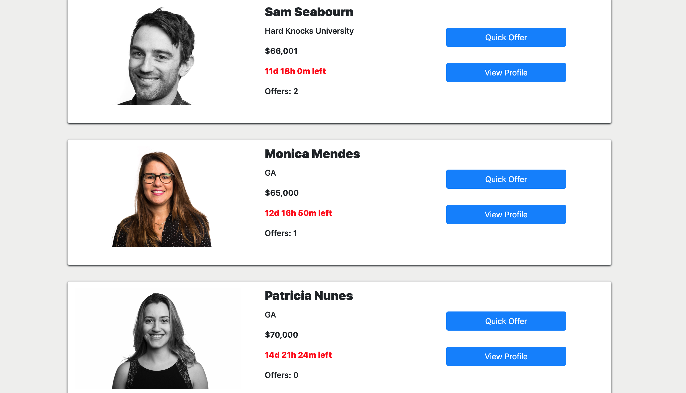
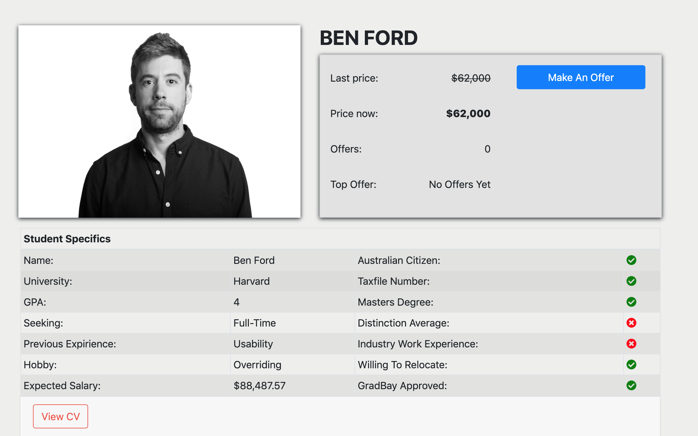
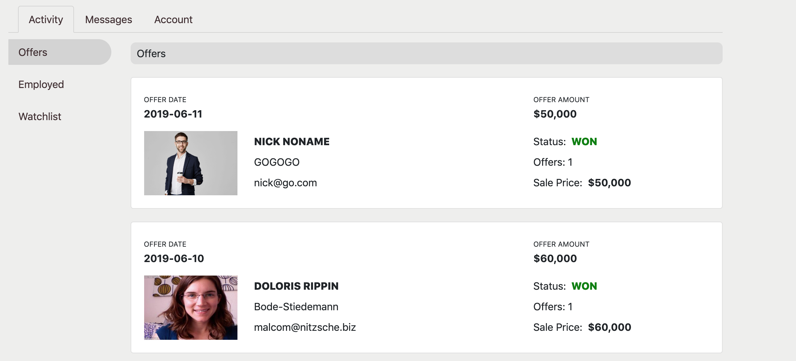
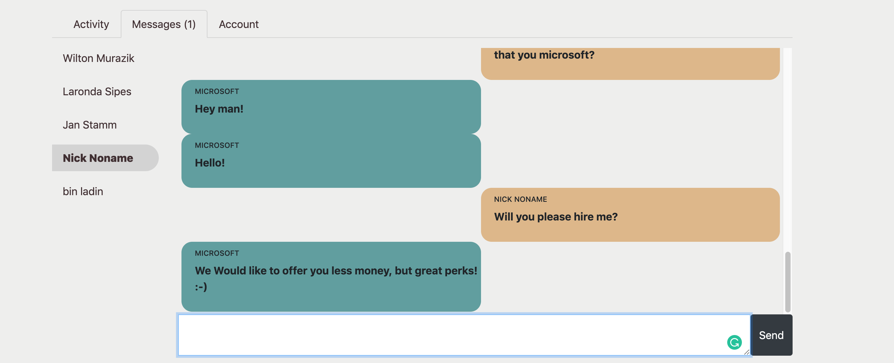

#  SEI-31 Final Project: GradBay

This was developed as part of SEI 31 for my final project, the goal was to build a web application from scratch, to show off what I have learned over my short, yet intense three month 'coding-bootcamp' at General Assembly. The type of web application I chose to create was completely up to me as well as the tech stack.

There were a few prerequisit conditions for the app, they are as follows:

You can see the site [here](https://bennnym.github.io/gradbay/).

## GradBay
---
### Home

The home page gives a brief explanation of who GradBay is and show's the student's who's auctions are ending soon.

#### Nav-Bar

The Nav-bar gives both types of users ( students and employers ) the ability to signup, signin or logout regardless of what page they are on. Once signed in the Nav also has added fucntionality such as the 'mail detector', this is the top right hand corner envelope icon. When a user has unread messages in their inbox this icon will appear in colour.

The Nav also has a 'Feeling Lucky' icon allowing the user to click and be directed to a randomly generated profile.

#### Ending Soon

The ending soon section shows three student auctions which are ending soon. You can make a quick bid on that student ( if you are logged in as an employer ) or click their image to be directed to their profile.

#### Who are we

The who are we component just shows a brief description of GradBay.

---

### Auctions Page

#### Search Input

The search input has the ability to search for any student in the database. The search algorithm was generated to be able to search for any combination of numbers that form a connection within a students name.

#### Student Cards

The students cards are generated and ordered in terms of auction ending time. Users have the ability to make a quick bid or navigate to the students profile.

---

### Profile Page

The profile page displays all of the students information including a full sized pdf version of the students CV. Employer users also have the ability to add a student to their watchlist with a simple click of a button and the functionality to send a student a private message.

---
### My GradBay

Here users have the ability to navigate to different tabs ( Students and Employers have different access )

#### Activity Tab

The Activity Tab is comprised of three subtabs

#### Offers

The Offers tab shows an Employer user all of the bids/offers they have made since signup, the detail shows the status of their offers, if they won the auction, lost or if the auction is still live, in which case they are linked to the profile fo that student.

#### Employer

This subtab shows all the Employers succesful auctions.

#### Watchlist

This subtab shows all of the students that the employer has chosen to add to their wishlist.

#### Message Tab

Here users ( students an employers ) can view messages between themselves in real time. Unread messages will appear in bold on the left hand tab and the tab itself will show the number of unread messages eg. Messages ( 2 ). The live messaging functionality is built in with a firebase hosted database.

#### Account Tab

Here users are able to update their login details.

## Tech Stack
**Languages:** HTML, CSS, Ruby and Javascript  
**Frameworks:** Rails, React  
**Back-end Server:** Heroku, Firebase  
**Front-end Hosting:** Github Pages  
**Other:** Font Awesome, Bootstrap, Spring, Formik, Cloudinary  
